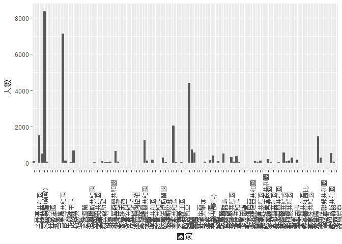

106-2 大數據分析方法 作業二
================
Yi-Ju Tseng

作業完整說明[連結](https://docs.google.com/document/d/1aLGSsGXhgOVgwzSg9JdaNz2qGPQJSoupDAQownkGf_I/edit?usp=sharing)

學習再也不限定在自己出生的國家，台灣每年有許多學生選擇就讀國外的大專院校，同時也有人多國外的學生來台灣就讀，透過分析[大專校院境外學生人數統計](https://data.gov.tw/dataset/6289)、[大專校院本國學生出國進修交流數](https://data.gov.tw/dataset/24730)、[世界各主要國家之我國留學生人數統計表](https://ws.moe.edu.tw/Download.ashx?u=C099358C81D4876CC7586B178A6BD6D5062C39FB76BDE7EC7685C1A3C0846BCDD2B4F4C2FE907C3E7E96F97D24487065577A728C59D4D9A4ECDFF432EA5A114C8B01E4AFECC637696DE4DAECA03BB417&n=4E402A02CE6F0B6C1B3C7E89FDA1FAD0B5DDFA6F3DA74E2DA06AE927F09433CFBC07A1910C169A1845D8EB78BD7D60D7414F74617F2A6B71DC86D17C9DA3781394EF5794EEA7363C&icon=..csv)可以了解103年以後各大專院校國際交流的情形。請同學分析以下議題，並以視覺化的方式呈現分析結果，呈現103年以後大專院校國際交流的情形。

來台境外生分析
--------------

### 資料匯入與處理

``` r
#這是R Code Chunk
library(jsonlite)
library(dplyr)
```

    ## 
    ## Attaching package: 'dplyr'

    ## The following objects are masked from 'package:stats':
    ## 
    ##     filter, lag

    ## The following objects are masked from 'package:base':
    ## 
    ##     intersect, setdiff, setequal, union

``` r
library(httr)
library(readr)
library(RCurl)
```

    ## Loading required package: bitops

``` r
library(curl)
```

    ## 
    ## Attaching package: 'curl'

    ## The following object is masked from 'package:readr':
    ## 
    ##     parse_date

    ## The following object is masked from 'package:httr':
    ## 
    ##     handle_reset

``` r
library(bitops)
library(readxl)
X103_ab103_C <- read_csv("C:/Users/IM/Desktop/R/103_ab103_C.csv")
```

    ## Parsed with column specification:
    ## cols(
    ##   洲別 = col_character(),
    ##   國別 = col_character(),
    ##   `學位生-正式修讀學位外國生` = col_integer(),
    ##   `學位生-僑生(含港澳)` = col_integer(),
    ##   `學位生-正式修讀學位陸生` = col_integer(),
    ##   `非學位生-外國交換生` = col_integer(),
    ##   `非學位生-外國短期研習及個人選讀` = col_integer(),
    ##   `非學位生-大專附設華語文中心學生` = col_integer(),
    ##   `非學位生-大陸研修生` = col_integer(),
    ##   `非學位生-海青班` = col_integer(),
    ##   境外專班 = col_integer()
    ## )

``` r
X103_ab103_S <- read_csv("C:/Users/IM/Desktop/R/103_ab103_S.csv")
```

    ## Parsed with column specification:
    ## cols(
    ##   學校類型 = col_character(),
    ##   學校代碼 = col_character(),
    ##   學校名稱 = col_character(),
    ##   `學位生-正式修讀學位外國生` = col_integer(),
    ##   `學位生-僑生(含港澳)` = col_integer(),
    ##   `學位生-正式修讀學位陸生` = col_integer(),
    ##   `非學位生-外國交換生` = col_integer(),
    ##   `非學位生-外國短期研習及個人選讀` = col_integer(),
    ##   `非學位生-大專附設華語文中心學生` = col_integer(),
    ##   `非學位生-大陸研修生` = col_character(),
    ##   `非學位生-海青班` = col_integer(),
    ##   境外專班 = col_integer()
    ## )

``` r
X104_ab104_C <- read_csv("C:/Users/IM/Desktop/R/104_ab104_C.csv")
```

    ## Parsed with column specification:
    ## cols(
    ##   洲別 = col_character(),
    ##   國別 = col_character(),
    ##   `學位生-正式修讀學位外國生` = col_integer(),
    ##   `學位生-僑生(含港澳)` = col_integer(),
    ##   `學位生-正式修讀學位陸生` = col_integer(),
    ##   `非學位生-外國交換生` = col_integer(),
    ##   `非學位生-外國短期研習及個人選讀` = col_integer(),
    ##   `非學位生-大專附設華語文中心學生` = col_integer(),
    ##   `非學位生-大陸研修生` = col_integer(),
    ##   `非學位生-海青班` = col_integer(),
    ##   境外專班 = col_integer()
    ## )

``` r
X104_ab104_S <- read_csv("C:/Users/IM/Desktop/R/104_ab104_S.csv")
```

    ## Parsed with column specification:
    ## cols(
    ##   學校類型 = col_character(),
    ##   學校代碼 = col_character(),
    ##   學校名稱 = col_character(),
    ##   `學位生-正式修讀學位外國生` = col_integer(),
    ##   `學位生-僑生(含港澳)` = col_integer(),
    ##   `學位生-正式修讀學位陸生` = col_integer(),
    ##   `非學位生-外國交換生` = col_integer(),
    ##   `非學位生-外國短期研習及個人選讀` = col_integer(),
    ##   `非學位生-大專附設華語文中心學生` = col_integer(),
    ##   `非學位生-大陸研修生` = col_character(),
    ##   `非學位生-海青班` = col_integer(),
    ##   境外專班 = col_integer()
    ## )

``` r
X105_ab105_C <- read_csv("C:/Users/IM/Desktop/R/105_ab105_C.csv")
```

    ## Parsed with column specification:
    ## cols(
    ##   洲別 = col_character(),
    ##   國別 = col_character(),
    ##   學位生_正式修讀學位外國生 = col_integer(),
    ##   `學位生_僑生(含港澳)` = col_integer(),
    ##   學位生_正式修讀學位陸生 = col_integer(),
    ##   非學位生_外國交換生 = col_integer(),
    ##   非學位生_外國短期研習及個人選讀 = col_integer(),
    ##   非學位生_大專附設華語文中心學生 = col_integer(),
    ##   非學位生_大陸研修生 = col_integer(),
    ##   非學位生_海青班 = col_integer(),
    ##   境外專班 = col_integer()
    ## )

``` r
X105_ab105_S <- read_csv("C:/Users/IM/Desktop/R/105_ab105_S.csv")
```

    ## Parsed with column specification:
    ## cols(
    ##   學校類型 = col_character(),
    ##   學校代碼 = col_character(),
    ##   學校名稱 = col_character(),
    ##   學位生_正式修讀學位外國生 = col_integer(),
    ##   `學位生_僑生(含港澳)` = col_integer(),
    ##   學位生_正式修讀學位陸生 = col_integer(),
    ##   非學位生_外國交換生 = col_integer(),
    ##   非學位生_外國短期研習及個人選讀 = col_integer(),
    ##   非學位生_大專附設華語文中心學生 = col_integer(),
    ##   非學位生_大陸研修生 = col_integer(),
    ##   非學位生_海青班 = col_integer(),
    ##   境外專班 = col_integer()
    ## )

``` r
X106_ab105_C <- read_csv("C:/Users/IM/Desktop/R/106_ab105_C.csv")
```

    ## Parsed with column specification:
    ## cols(
    ##   洲別 = col_character(),
    ##   國別 = col_character(),
    ##   學位生_正式修讀學位外國生 = col_integer(),
    ##   `學位生_僑生(含港澳)` = col_integer(),
    ##   學位生_正式修讀學位陸生 = col_integer(),
    ##   非學位生_外國交換生 = col_integer(),
    ##   非學位生_外國短期研習及個人選讀 = col_integer(),
    ##   非學位生_大專附設華語文中心學生 = col_integer(),
    ##   非學位生_大陸研修生 = col_integer(),
    ##   非學位生_海青班 = col_integer(),
    ##   境外專班 = col_integer()
    ## )

``` r
X106_ab105_S <- read_csv("C:/Users/IM/Desktop/R/106_ab105_S.csv")
```

    ## Parsed with column specification:
    ## cols(
    ##   學校類型 = col_character(),
    ##   學校代碼 = col_character(),
    ##   學校名稱 = col_character(),
    ##   學位生_正式修讀學位外國生 = col_integer(),
    ##   `學位生_僑生(含港澳)` = col_integer(),
    ##   學位生_正式修讀學位陸生 = col_integer(),
    ##   非學位生_外國交換生 = col_integer(),
    ##   非學位生_外國短期研習及個人選讀 = col_integer(),
    ##   非學位生_大專附設華語文中心學生 = col_integer(),
    ##   非學位生_大陸研修生 = col_integer(),
    ##   非學位生_海青班 = col_integer(),
    ##   境外專班 = col_integer()
    ## )

``` r
English <- read_excel("C:/Users/IM/Desktop/English.xlsx")
```

### 哪些國家來台灣唸書的學生最多呢？

``` r
#這是R Code Chunk
head(iris)
```

    ##   Sepal.Length Sepal.Width Petal.Length Petal.Width Species
    ## 1          5.1         3.5          1.4         0.2  setosa
    ## 2          4.9         3.0          1.4         0.2  setosa
    ## 3          4.7         3.2          1.3         0.2  setosa
    ## 4          4.6         3.1          1.5         0.2  setosa
    ## 5          5.0         3.6          1.4         0.2  setosa
    ## 6          5.4         3.9          1.7         0.4  setosa

``` r
knitr::kable(head(iris))
```

|  Sepal.Length|  Sepal.Width|  Petal.Length|  Petal.Width| Species |
|-------------:|------------:|-------------:|------------:|:--------|
|           5.1|          3.5|           1.4|          0.2| setosa  |
|           4.9|          3.0|           1.4|          0.2| setosa  |
|           4.7|          3.2|           1.3|          0.2| setosa  |
|           4.6|          3.1|           1.5|          0.2| setosa  |
|           5.0|          3.6|           1.4|          0.2| setosa  |
|           5.4|          3.9|           1.7|          0.4| setosa  |

``` r
library(knitr)
kable(head(iris))
```

|  Sepal.Length|  Sepal.Width|  Petal.Length|  Petal.Width| Species |
|-------------:|------------:|-------------:|------------:|:--------|
|           5.1|          3.5|           1.4|          0.2| setosa  |
|           4.9|          3.0|           1.4|          0.2| setosa  |
|           4.7|          3.2|           1.3|          0.2| setosa  |
|           4.6|          3.1|           1.5|          0.2| setosa  |
|           5.0|          3.6|           1.4|          0.2| setosa  |
|           5.4|          3.9|           1.7|          0.4| setosa  |

``` r
New103104<-inner_join(X103_ab103_C,X104_ab104_C,by="國別")
New105106<-inner_join(X105_ab105_C,X106_ab105_C,by="國別")
New103104105106<-inner_join(New103104,New105106,by="國別")
New103104105106$境外專班.y.y<-as.numeric(gsub("—","0",New103104105106$境外專班.y.y))
New103104105106$境外專班.x.y<-as.numeric(gsub("—","0",New103104105106$境外專班.x.y))
New103104105106$境外專班.y.y<-as.numeric(gsub("—","0",New103104105106$境外專班.y.y))
New103104105106$境外專班.y.y<-as.numeric(gsub("—","0",New103104105106$境外專班.y.x))
New103104105106$境外專班加總1<-New103104105106$境外專班.y.y+New103104105106$境外專班.y.x
New103104105106$境外專班加總2<-New103104105106$境外專班.x.y+New103104105106$境外專班.x.x
New103104105106$境外專班加總<-New103104105106$境外專班加總1+New103104105106$境外專班加總2
New103104105106<-arrange(New103104105106,desc(境外專班加總))
knitr::kable(New103104105106[1:10,])
```

| 洲別.x.x | 國別     | 學位生-正式修讀學位外國生.x | 學位生-僑生(含港澳).x | 學位生-正式修讀學位陸生.x | 非學位生-外國交換生.x | 非學位生-外國短期研習及個人選讀.x | 非學位生-大專附設華語文中心學生.x | 非學位生-大陸研修生.x | 非學位生-海青班.x | 境外專班.x.x | 洲別.y.x | 學位生-正式修讀學位外國生.y | 學位生-僑生(含港澳).y | 學位生-正式修讀學位陸生.y | 非學位生-外國交換生.y | 非學位生-外國短期研習及個人選讀.y | 非學位生-大專附設華語文中心學生.y | 非學位生-大陸研修生.y | 非學位生-海青班.y | 境外專班.y.x | 洲別.x.y | 學位生\_正式修讀學位外國生.x | 學位生\_僑生(含港澳).x | 學位生\_正式修讀學位陸生.x | 非學位生\_外國交換生.x | 非學位生\_外國短期研習及個人選讀.x | 非學位生\_大專附設華語文中心學生.x | 非學位生\_大陸研修生.x | 非學位生\_海青班.x | 境外專班.x.y | 洲別.y.y | 學位生\_正式修讀學位外國生.y | 學位生\_僑生(含港澳).y | 學位生\_正式修讀學位陸生.y | 非學位生\_外國交換生.y | 非學位生\_外國短期研習及個人選讀.y | 非學位生\_大專附設華語文中心學生.y | 非學位生\_大陸研修生.y | 非學位生\_海青班.y | 境外專班.y.y | 境外專班加總1 | 境外專班加總2 | 境外專班加總 |
|:---------|:---------|:---------------------------:|:---------------------:|:-------------------------:|:---------------------:|:---------------------------------:|:---------------------------------:|:---------------------:|:-----------------:|:------------:|:---------|:---------------------------:|:---------------------:|:-------------------------:|:---------------------:|:---------------------------------:|:---------------------------------:|:---------------------:|:-----------------:|:------------:|:---------|:----------------------------:|:----------------------:|:--------------------------:|:----------------------:|:----------------------------------:|:----------------------------------:|:----------------------:|:------------------:|:------------:|:---------|:----------------------------:|:----------------------:|:--------------------------:|:----------------------:|:----------------------------------:|:----------------------------------:|:----------------------:|:------------------:|:------------:|:-------------:|:-------------:|:------------:|
| 亞洲     | 越南     |             2450            |          291          |             0             |           11          |                 41                |                922                |           0           |         0         |      290     | 亞洲     |             2586            |          307          |             0             |           50          |                 47                |                1096               |           0           |         0         |      373     | 亞洲     |             2807             |           358          |              0             |           34           |                 277                |                1512                |            0           |          0         |      354     | 亞洲     |             3884             |           581          |              0             |           34           |                 277                |                2541                |            0           |         22         |      373     |      746      |      644      |     1390     |
| 亞洲     | 馬來西亞 |             3671            |          6254         |             0             |           35          |                839                |                 85                |           0           |        2402       |      99      | 亞洲     |             4465            |          7053         |             0             |           38          |                848                |                247                |           0           |        2291       |      112     | 亞洲     |             5044             |          7645          |              0             |           53           |                 946                |                 261                |            0           |        2215        |      147     | 亞洲     |             5449             |          7984          |              0             |           53           |                 946                |                 338                |            0           |        2309        |      112     |      224      |      246      |      470     |
| 亞洲     | 新加坡   |             100             |           99          |             0             |          107          |                340                |                 32                |           0           |         0         |      10      | 亞洲     |             101             |           89          |             0             |          116          |                240                |                110                |           0           |         0         |       7      | 亞洲     |              107             |           89           |              0             |           127          |                 396                |                 78                 |            0           |          0         |       0      | 亞洲     |              102             |           91           |              0             |           127          |                 396                |                 54                 |            0           |          0         |       7      |       14      |       10      |      24      |
| 亞洲     | 中國大陸 |              0              |           0           |            5881           |           0           |                 0                 |                377                |         27030         |         0         |       0      | 亞洲     |              0              |           0           |            7813           |           0           |                 0                 |                 24                |         34114         |         0         |       0      | 亞洲     |               0              |            0           |            9327            |            0           |                  0                 |                  6                 |          32648         |          0         |       0      | 亞洲     |               0              |            0           |            9462            |            0           |                  0                 |                 18                 |          25824         |          0         |       0      |       0       |       0       |       0      |
| 亞洲     | 香港     |              0              |          5814         |             0             |          193          |                220                |                 59                |           0           |         0         |       0      | 亞洲     |              0              |          7333         |             0             |          188          |                205                |                507                |           0           |         0         |       0      | 亞洲     |               0              |          8190          |              0             |           149          |                 242                |                 79                 |            0           |          0         |       0      | 亞洲     |               0              |          8329          |              0             |           149          |                 242                |                 41                 |            0           |          0         |       0      |       0       |       0       |       0      |
| 亞洲     | 日本     |             698             |          177          |             0             |          494          |                1423               |                3024               |           0           |         0         |       0      | 亞洲     |             791             |          175          |             0             |          499          |                1554               |                3436               |           0           |         0         |       0      | 亞洲     |              931             |           177          |              0             |           561          |                1486                |                4387                |            0           |          0         |       0      | 亞洲     |             1183             |           157          |              0             |           561          |                1486                |                5000                |            0           |          0         |       0      |       0       |       0       |       0      |
| 亞洲     | 澳門     |              0              |          4693         |             0             |           10          |                 3                 |                 17                |           0           |         0         |       0      | 亞洲     |              0              |          5001         |             0             |           21          |                 12                |                118                |           0           |         0         |       0      | 亞洲     |               0              |          5259          |              0             |           19           |                  5                 |                  3                 |            0           |          0         |       0      | 亞洲     |               0              |          5116          |              0             |           19           |                  5                 |                  1                 |            0           |          0         |       0      |       0       |       0       |       0      |
| 亞洲     | 南韓     |             511             |          186          |             0             |          708          |                248                |                1933               |           0           |         1         |       0      | 亞洲     |             596             |          196          |             0             |          781          |                417                |                2070               |           0           |         2         |       0      | 亞洲     |              668             |           188          |              0             |           708          |                 441                |                2568                |            0           |          2         |       0      | 亞洲     |              746             |           170          |              0             |           708          |                 441                |                2658                |            0           |          1         |       0      |       0       |       0       |       0      |
| 亞洲     | 印尼     |             1374            |          971          |             0             |           35          |                134                |                976                |           0           |         69        |       0      | 亞洲     |             1623            |          1101         |             0             |           68          |                162                |                1442               |           0           |         58        |       0      | 亞洲     |             1923             |          1208          |              0             |           113          |                 197                |                1626                |            0           |         87         |       0      | 亞洲     |             2662             |          1401          |              0             |           113          |                 197                |                1959                |            0           |         121        |       0      |       0       |       0       |       0      |
| 亞洲     | 泰國     |             548             |          268          |             0             |          108          |                150                |                461                |           0           |         0         |       0      | 亞洲     |             506             |          260          |             0             |          129          |                241                |                455                |           0           |         0         |       0      | 亞洲     |              544             |           240          |              0             |           146          |                 246                |                 595                |            0           |          0         |       0      | 亞洲     |              635             |           212          |              0             |           146          |                 246                |                 884                |            0           |          2         |       0      |       0       |       0       |       0      |

### 哪間大學的境外生最多呢？

``` r
#這是R Code Chunk
New103104S<-inner_join(X103_ab103_S,X104_ab104_S,by="學校名稱")
New105106S<-inner_join(X105_ab105_S,X106_ab105_S,by="學校名稱")
New103104105106S<-inner_join(New103104S,New105106S,by="學校名稱")

New103104105106S$境外專班.y.y<-as.numeric(gsub("—","0",New103104105106S$境外專班.y.y))
New103104105106S$境外專班.x.y<-as.numeric(gsub("—","0",New103104105106S$境外專班.x.y))
New103104105106S$境外專班.y.y<-as.numeric(gsub("—","0",New103104105106S$境外專班.y.y))
New103104105106S$境外專班.y.y<-as.numeric(gsub("—","0",New103104105106S$境外專班.y.x))
New103104105106S$境外專班加總1<-New103104105106S$境外專班.y.y+New103104105106S$境外專班.y.x
New103104105106S$境外專班加總2<-New103104105106S$境外專班.x.y+New103104105106S$境外專班.x.x
New103104105106S$境外專班加總<-New103104105106S$境外專班加總1+New103104105106S$境外專班加總2
New103104105106S<-arrange(New103104105106S,desc(境外專班加總))
knitr::kable(New103104105106S[1:10,])
```

| 學校類型.x.x | 學校代碼.x.x | 學校名稱         | 學位生-正式修讀學位外國生.x | 學位生-僑生(含港澳).x | 學位生-正式修讀學位陸生.x | 非學位生-外國交換生.x | 非學位生-外國短期研習及個人選讀.x | 非學位生-大專附設華語文中心學生.x | 非學位生-大陸研修生.x | 非學位生-海青班.x | 境外專班.x.x | 學校類型.y.x | 學校代碼.y.x | 學位生-正式修讀學位外國生.y | 學位生-僑生(含港澳).y | 學位生-正式修讀學位陸生.y | 非學位生-外國交換生.y | 非學位生-外國短期研習及個人選讀.y | 非學位生-大專附設華語文中心學生.y | 非學位生-大陸研修生.y | 非學位生-海青班.y | 境外專班.y.x | 學校類型.x.y | 學校代碼.x.y | 學位生\_正式修讀學位外國生.x | 學位生\_僑生(含港澳).x | 學位生\_正式修讀學位陸生.x | 非學位生\_外國交換生.x | 非學位生\_外國短期研習及個人選讀.x | 非學位生\_大專附設華語文中心學生.x | 非學位生\_大陸研修生.x | 非學位生\_海青班.x | 境外專班.x.y | 學校類型.y.y | 學校代碼.y.y | 學位生\_正式修讀學位外國生.y | 學位生\_僑生(含港澳).y | 學位生\_正式修讀學位陸生.y | 非學位生\_外國交換生.y | 非學位生\_外國短期研習及個人選讀.y | 非學位生\_大專附設華語文中心學生.y | 非學位生\_大陸研修生.y | 非學位生\_海青班.y | 境外專班.y.y | 境外專班加總1 | 境外專班加總2 | 境外專班加總 |
|:-------------|:-------------|:-----------------|:---------------------------:|:---------------------:|:-------------------------:|:---------------------:|:---------------------------------:|:---------------------------------:|:----------------------|:-----------------:|:------------:|:-------------|:-------------|:---------------------------:|:---------------------:|:-------------------------:|:---------------------:|:---------------------------------:|:---------------------------------:|:----------------------|:-----------------:|:------------:|:-------------|:-------------|:----------------------------:|:----------------------:|:--------------------------:|:----------------------:|:----------------------------------:|:----------------------------------:|:----------------------:|:------------------:|:------------:|:-------------|:-------------|:----------------------------:|:----------------------:|:--------------------------:|:----------------------:|:----------------------------------:|:----------------------------------:|:----------------------:|:------------------:|:------------:|:-------------:|:-------------:|:------------:|
| 大專校院     | 1064         | 美和科技大學     |              3              |           5           |             1             |           0           |                 24                |                 0                 | …                     |         0         |      88      | 大專校院     | 1064         |              3              |           5           |             0             |           0           |                 0                 |                 0                 | …                     |         0         |      206     | 大專校院     | 1064         |               3              |            5           |              0             |            0           |                  0                 |                  0                 |            0           |          0         |      197     | 大專校院     | 1064         |              35              |            5           |              0             |            0           |                  0                 |                  0                 |            0           |          0         |      206     |      412      |      285      |      697     |
| 大專校院     | 1030         | 龍華科技大學     |             103             |           11          |             46            |           5           |                 0                 |                 0                 | …                     |         90        |      92      | 大專校院     | 1030         |             138             |           28          |             62            |           22          |                 0                 |                 49                | …                     |        117        |      82      | 大專校院     | 1030         |              145             |           37           |             57             |           21           |                  0                 |                 68                 |            0           |         105        |      82      | 大專校院     | 1030         |              222             |           92           |             63             |           21           |                  0                 |                 93                 |            0           |         80         |      82      |      164      |      174      |      338     |
| 大專校院     | 0015         | 國立彰化師範大學 |              24             |          167          |             8             |           9           |                 20                |                 28                | …                     |         0         |      60      | 大專校院     | 0015         |              28             |          172          |             16            |           11          |                 0                 |                165                | …                     |         0         |      65      | 大專校院     | 0015         |              38              |           187          |             25             |            6           |                  0                 |                 44                 |            0           |          0         |      85      | 大專校院     | 0015         |              48              |           200          |             27             |            6           |                  0                 |                 77                 |            0           |          0         |      65      |      130      |      145      |      275     |
| 大專校院     | 1014         | 義守大學         |             556             |          464          |            119            |           12          |                 0                 |                266                | …                     |         0         |      71      | 大專校院     | 1014         |             655             |          577          |            168            |           8           |                 0                 |                389                | …                     |         0         |      51      | 大專校院     | 1014         |              686             |           677          |             167            |           24           |                  0                 |                 200                |            0           |          0         |      23      | 大專校院     | 1014         |              711             |           668          |             154            |           24           |                  0                 |                 370                |            0           |          0         |      51      |      102      |       94      |      196     |
| 大專校院     | 1026         | 樹德科技大學     |             111             |          106          |             97            |           8           |                 11                |                 0                 | …                     |         0         |      39      | 大專校院     | 1026         |             132             |          171          |            127            |           9           |                 9                 |                 0                 | …                     |         0         |      27      | 大專校院     | 1026         |              150             |           218          |             163            |           21           |                  8                 |                  0                 |            0           |          0         |      26      | 大專校院     | 1026         |              176             |           241          |             161            |           21           |                  8                 |                 54                 |            0           |          0         |      27      |       54      |       65      |      119     |
| 大專校院     | 0023         | 國立雲林科技大學 |              66             |          125          |             44            |           13          |                 6                 |                 0                 | …                     |         0         |       0      | 大專校院     | 0023         |              80             |          180          |             61            |           12          |                 2                 |                 0                 | …                     |         0         |      24      | 大專校院     | 0023         |              76              |           203          |             91             |            9           |                  3                 |                  0                 |            0           |          0         |      51      | 大專校院     | 0023         |              102             |           244          |             111            |            9           |                  3                 |                  0                 |            0           |          0         |      24      |       48      |       51      |      99      |
| 大專校院     | 1073         | 醒吾科技大學     |              12             |           11          |             4             |           0           |                 0                 |                 0                 | …                     |         0         |      19      | 大專校院     | 1073         |              16             |           20          |             4             |           0           |                 0                 |                 0                 | …                     |         0         |      13      | 大專校院     | 1073         |              19              |           27           |              6             |            0           |                  0                 |                  0                 |            0           |          0         |      23      | 大專校院     | 1073         |              169             |           33           |              7             |            0           |                  0                 |                  0                 |            0           |          0         |      13      |       26      |       42      |      68      |
| 大專校院     | 0021         | 國立暨南國際大學 |              70             |          455          |             6             |           9           |                 1                 |                 0                 | …                     |         0         |      13      | 大專校院     | 0021         |              69             |          570          |             14            |           13          |                 2                 |                 0                 | …                     |         0         |       9      | 大專校院     | 0021         |              62              |           647          |             20             |            6           |                  1                 |                  0                 |            0           |          0         |       0      | 大專校院     | 0021         |              68              |           678          |             19             |            6           |                  1                 |                  0                 |            0           |          0         |       9      |       18      |       13      |      31      |
| 大專校院     | 0001         | 國立政治大學     |             488             |          483          |            194            |          570          |                 68                |                902                | …                     |         0         |       0      | 大專校院     | 0001         |             518             |          547          |            282            |          513          |                 76                |                935                | …                     |         0         |       0      | 大專校院     | 0001         |              534             |           588          |             319            |           572          |                 66                 |                 910                |            0           |          0         |       0      | 大專校院     | 0001         |              537             |           622          |             344            |           572          |                 66                 |                 920                |            0           |          0         |       0      |       0       |       0       |       0      |
| 大專校院     | 0002         | 國立清華大學     |             320             |          234          |            139            |           40          |                120                |                 0                 | …                     |         0         |       0      | 大專校院     | 0002         |             382             |          243          |            185            |           60          |                106                |                 0                 | …                     |         0         |       0      | 大專校院     | 0002         |              457             |           274          |             215            |           56           |                 147                |                  0                 |            0           |          0         |       0      | 大專校院     | 0002         |              505             |           444          |             247            |           56           |                 147                |                 360                |            0           |          0         |       0      |       0       |       0       |       0      |

### 各個國家來台灣唸書的學生人數條狀圖

``` r
#這是R Code Chunk
library(ggplot2) 
library(datasets) 
library(data.table)
```

    ## 
    ## Attaching package: 'data.table'

    ## The following objects are masked from 'package:dplyr':
    ## 
    ##     between, first, last

``` r
ggplot()+geom_bar(data=New103104105106,aes(x=國別,y=境外專班加總),
                  stat = "identity")
```


### 各個國家來台灣唸書的學生人數面量圖

``` r
#這是R Code Chunk
```

台灣學生國際交流分析
--------------------

### 資料匯入與處理

``` r
#這是R Code Chunk
library(readxl)
library(dplyr)
Student_RPT_07 <- read_excel("C:/Users/IM/Desktop/Student_RPT_07.xlsx")
```

### 台灣大專院校的學生最喜歡去哪些國家進修交流呢？

``` r
#這是R Code Chunk
filter1<-filter(Student_RPT_07,學年度>103)
filter1$X__7<-as.numeric(gsub("—","0",filter1$X__7))
filter1$country<-filter1$`對方學校(機構)國別(地區)`


group1<-group_by(filter1,country)
group1<-summarise(group1,total=sum(X__7))
group1<-arrange(group1,desc(total))
knitr::kable(group1[1:10,])
```

| country  |  total|
|:---------|------:|
| 中國大陸 |   4164|
| 日本     |   3723|
| 美國     |   2293|
| 南韓     |   1251|
| 大陸地區 |    800|
| 德國     |    761|
| 法國     |    664|
| 英國     |    372|
| 西班牙   |    354|
| 加拿大   |    349|

### 哪間大學的出國交流學生數最多呢？

``` r
#這是R Code Chunk

filter2<-filter(Student_RPT_07,學年度>103)
filter2$X__7<-as.numeric(gsub("—","0",filter2$X__7))
filter2$school<-filter2$X__4
group2<-group_by(filter2,school)
group2<-summarise(group2,total=sum(X__7))
group2<-arrange(group2,desc(total))
knitr::kable(group2[1:10,])
```

| school       |  total|
|:-------------|------:|
| 國立臺灣大學 |   1114|
| 淡江大學     |   1080|
| 國立政治大學 |   1018|
| 逢甲大學     |    734|
| 元智大學     |    662|
| 實踐大學     |    541|
| 國立交通大學 |    505|
| 國立臺北大學 |    504|
| 國立成功大學 |    474|
| 東海大學     |    450|

### 台灣大專院校的學生最喜歡去哪些國家進修交流條狀圖

``` r
#這是R Code Chunk

library(ggplot2) 
library(datasets) 
library(data.table)
ggplot()+geom_bar(data=group1,aes(x=country,y=total),
                  stat = "identity")
```



### 台灣大專院校的學生最喜歡去哪些國家進修交流面量圖

``` r
#這是R Code Chunk
```

台灣學生出國留學分析
--------------------

### 資料匯入與處理

``` r
#這是R Code Chunk
library(readxl)
English <- read_excel("C:/Users/IM/Desktop/English.xlsx")
```

### 台灣學生最喜歡去哪些國家留學呢？

``` r
#這是R Code Chunk
English$`Head Count`<-as.numeric(English$`Head Count`)
English<-arrange(English,desc(`Head Count`))
knitr::kable(English[1:10,])
```

| Continent | Country                                              |  Head Count|
|:----------|:-----------------------------------------------------|-----------:|
| America   | United States of America                             |       21127|
| Oceania   | Australia                                            |       13582|
| Asia      | Japan                                                |        8444|
| America   | Canada                                               |        4827|
| Europe    | United Kingdom of Great Britain and Northern Ireland |        3815|
| Europe    | Germany                                              |        1488|
| Oceania   | New Zealand                                          |        1106|
| Europe    | Poland                                               |         561|
| Asia      | Malaysia                                             |         502|
| Europe    | Austria                                              |         419|

### 台灣學生最喜歡去哪些國家留學面量圖

``` r
#這是R Code Chunk
```

綜合分析
--------

請問來台讀書與離台讀書的來源國與留學國趨勢是否相同(5分)？想來台灣唸書的境外生，他們的母國也有很多台籍生嗎？請圖文並茂說明你的觀察(10分)。
